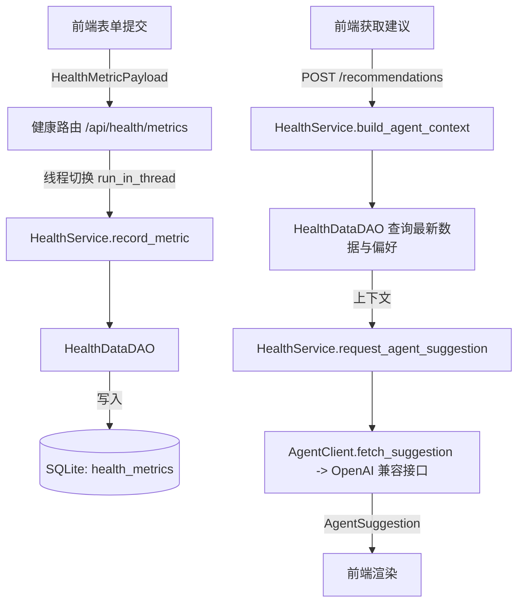

# 模块：health_agent

## 公开接口
- `POST /api/health/metrics`：新增一条健康体测记录。
- `GET /api/health/metrics/latest`：获取最新体测记录。
- `GET /api/health/metrics/history?limit=N`：按时间倒序获取历史体测记录。
- `GET /api/health/preferences`：获取健康目标与偏好。
- `PUT /api/health/preferences`：更新健康目标与偏好。
- `POST /api/health/recommendations`：调用 LLM 生成结构化健康建议。

## 业务定位
- 为移动端 Health Agent 提供体测数据管理、个性化目标维护与 AI 建议生成功能。
- 业务流程：用户通过前端录入体测数据，后端持久化并按需汇总；在生成建议时，后端将最新数据与偏好送入 LLM，返回结构化结果供前端展示。

## 数据流


## 数据模型
- `health_metrics`：保存体重、体脂率、BMI、肌肉率、水分率等指标，以 recorded_at 记录采样时间。
- `health_preferences`：保存目标体重、热量预算、饮食偏好、活动水平、睡眠/饮水目标等个性化配置。

## 用法示例
```bash
# 创建体测数据
curl -X POST http://localhost:8000/api/health/metrics \
  -H "Authorization: Bearer <token>" \
  -H "Content-Type: application/json" \
  -d '{
        "weight_kg": 68.5,
        "body_fat_percent": 20.1,
        "bmi": 22.5,
        "muscle_percent": 38.0,
        "water_percent": 55.4
      }'

# 生成 AI 建议
curl -X POST http://localhost:8000/api/health/recommendations \
  -H "Authorization: Bearer <token>"
```

